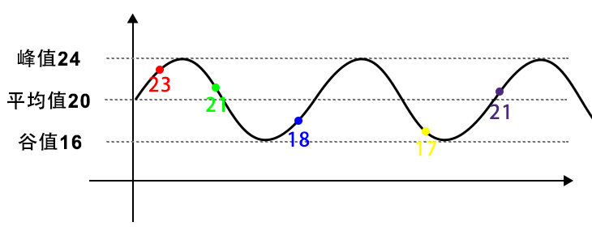

## RelativelyAverage

### Problem 

相对平均数，即在一定误差内，将总数进行平分。实际运用中，例如`抢红包问题`、`消星星的颜色分布问题`等。

比如，有个红包 100 元 5个人分，误差控制在 10 块钱以内。那么该 5 个人所得到的分配可能如下图所示：




现，给定总额 `total`，份额 `n` ，以及误差 `correct`，求一个随机相对平均数组。

### Solution

想起数学中的平均数速算，削峰填谷法，例：

> 求，21，19，16，23 的平均值（）

那么，利用削峰填谷法解：

> 假定 20， 那么 21，19，16，23 减去 20
>
> 分别为 +1, -1, -4, +3，最后 -1
>
> 即，平均数为 20 - 1 / 4

因此，本文想到了采用削峰填谷的方式获得随机的相对平均数:

```
1. 对每个份额进行 [low, high] 误差区间内取随机值
2. 总份额 减去 初始值相加结果，得到总份额误差值
3. 根据总份额误差值，如果小于误差范围内，直接对某个允许份额进行削峰填谷
				  否则，取随机值，然后对某个允许份额进行削峰填谷
```

### Code

| 代码              | 备注                    | 链接                           |
| ----------------- | ----------------------- | ------------------------------ |
| relativelyAverage | java 的 int和double版本 | [java](relativelyAverage.java) |

```java
/**
* 整数版本
* @param total    总额
* @param n        份数
* @param correct  误差
* @return         各个份数组成的数组
*/
public static int[] relativelyAverage(int total, int n, int correct) {
    // 计算波动边界
    int halfCorrect = correct / 2;
    int lowBound = total / n - halfCorrect;
    int highBound = lowBound + correct;

    // 将数组进行范围内随机初始化
    int[] result = new int[n];
    for (int i = 0; i < n; ++i) {
    	result[i] = lowBound + (int)((correct + 1) * Math.random());
    }

    // 那么，剩余误差还有：
    int residue = 0;
    for (int i = 0; i < n; ++i) {
    	residue += result[i];
    }
    residue = total - residue;
    while (residue != 0) {
        int wave;
        if (Math.abs(residue) < correct) {
            wave = residue;
        }
        else {
         wave = (int)(Math.random() * (correct + 1));
        }

        // 随机选取数组中的一个值
        int picked = (int)(Math.random() * n);
        if (result[picked] >= lowBound && result[picked] + wave <= highBound) {
            result[picked] = result[picked] + wave;
            residue = residue - wave;
        }
    }

    return result;
}
```

