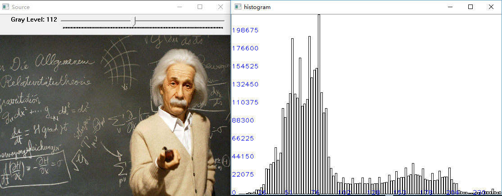
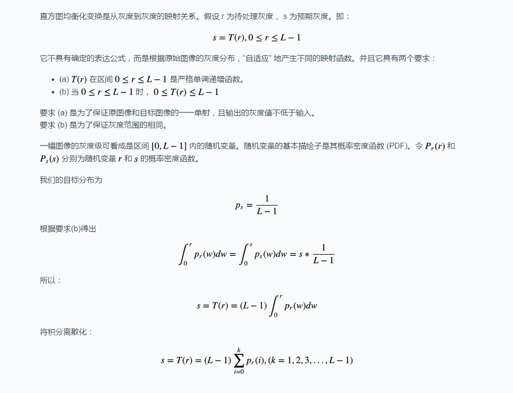

## 直方图及其应用

### 1. 计算并画出直方图

#### 1.1 解释

计算直方图 `cv::calcHist` 函数
>```
>void calcHist( const Mat* images, int nimages,
>                          const int* channels, InputArray mask,
>                          OutputArray hist, int dims, const int* histSize,
>                          const float** ranges, bool uniform = true, bool accumulate = false );
>```

其中

* `int dims`，代表统计特征的数目，例 `dims = 1 ` 统计单通道直方图。
* `int histSize` / `bins`， 代表统计特征空间的 **子区段** 的数目，例 `bins = 16` 坐标系里横轴有 16 段。
* `const float** ranges`， 特征空间的取值范围，例 `ranges = [0, 255]` 那么读取图中 0 到 255 的数据加入到各个区段。

#### 1.2 代码及效果

```cpp
/**
@version: opencv-3.2.0-vc14
@patrick 2017-6-30
**/

// 画出直方图
// 输入原图和子区段数
Mat DrawHist(Mat img, int histSize)
{
	if (img.empty() || histSize == 0) {
		return Mat();
	}

	if (img.channels() == 3) {
		cvtColor(img, img, CV_RGB2GRAY);
	}

	// 计算直方图
	Mat hist;
	const float *hist_range = range;
	calcHist(&img, 1, 0, Mat(), hist, 1, &histSize, &hist_range, true, false);

	double hist_max;
	minMaxLoc(hist, 0, &hist_max);

	// 归一化
	normalize(hist, hist, 1, 0, NORM_MINMAX);

	// 画直方图
	Mat histImg = Mat(400, 600, CV_8UC3, Scalar(255, 255, 255));
	double bin_w = histImg.size().width / histSize;
	double bin_h = histImg.size().height / hist_max;
	for (int i = 0; i < histSize; ++i) {
		rectangle(histImg, Rect(i * bin_w, histImg.size().height * (1 - hist.at<float>(i)),
			bin_w, histImg.size().height * hist.at<float>(i)), Scalar(0, 0, 0), 1, LineTypes::LINE_8);
	}

	// 画纵坐标刻度 （像素个数）
	for (int i = 0; i <= 10; ++i) {
		int val = cvRound(hist_max * i / 10);
		char buf[10];
		sprintf(buf, "%d", val);
		putText(histImg, buf, Point(0, histImg.size().height - bin_h * val), CV_FONT_HERSHEY_PLAIN, 1, Scalar(255, 0, 0), 1, LineTypes::LINE_8);
	}

	// 画横坐标刻度 （灰度值）
	for (int i = 1; i <= 10; ++i) {
		int val = cvRound((double)255 * i / 10);
		char buf[10];
		sprintf(buf, "%d", val);
		putText(histImg, buf, Point(histSize * i / 10 * bin_w, histImg.size().height), CV_FONT_HERSHEY_PLAIN, 1, Scalar(255, 0, 0), 1, LineTypes::LINE_8);
	}

	return histImg;
}
```

效果：



### 2 直方图均衡化

#### 2.1 解释和原理

直方图均衡化，指将某些图片过于集中的像素进行拉伸，使得图片直方图分布更加均匀，从而达到增强对比度，增强图像的方法。过程如下图：


数学原理如下：



#### 2.2 代码及效果

代码：

```cpp
/**
@version: opencv-3.2.0-vc14
@patrick 2017-6-26
**/
// 直方图均衡化
// 输入原图像和子区段数，输出目标图像
Mat HistEqualization(Mat srcImg, int histSize)
{
	if (srcImg.empty()) {
		return Mat();
	}

	if (srcImg.channels() == 3) {
		cvtColor(srcImg, srcImg, CV_RGB2GRAY);
	}

	// 计算直方图
	Mat src_hist;
	float range[] = { 0, 255 };
	const float *hist_range = range;
	calcHist(&srcImg, 1, 0, Mat(), src_hist, 1, &histSize, &hist_range, true, false);

	// 获得均衡化映射表
	int* mappingTable = new int[histSize];
	double* temp = new double[histSize];
	long long MN = srcImg.cols * srcImg.rows;
	temp[0] = (histSize - 1) * (double)src_hist.at<float>(0) / MN;
	mappingTable[0] = cvRound(temp[0]);
	for (int i = 1; i < histSize; ++i) {
		temp[i] = (double)temp[i - 1] + (histSize - 1) * (double)src_hist.at<float>(i) / MN;
		mappingTable[i] = cvRound(temp[i]);
	}

	// 根据映射表，改变图像
	Mat dstImg(srcImg.size(), srcImg.type());
	int step = srcImg.step;
	uchar* pSrc = srcImg.data;
	uchar* pDst = dstImg.data;
	for (int i = 0; i < srcImg.rows; ++i) {
		for (int j = 0; j < srcImg.cols; ++j) {
			pDst[i * step + j] = mappingTable[pSrc[i * step + j]];
		}
	}

	return dstImg;
}

```

图像效果：


直方图效果：


### 3 直方图匹配（直方图规定化）

### 参考:
[1] [直方图计算](http://www.opencv.org.cn/opencvdoc/2.3.2/html/doc/tutorials/imgproc/histograms/histogram_calculation/histogram_calculation.html#histogram-calculation)

[2] [灰度图像--图像增强 直方图均衡化（Histogram equalization）](http://blog.csdn.net/tonyshengtan/article/details/43448787)